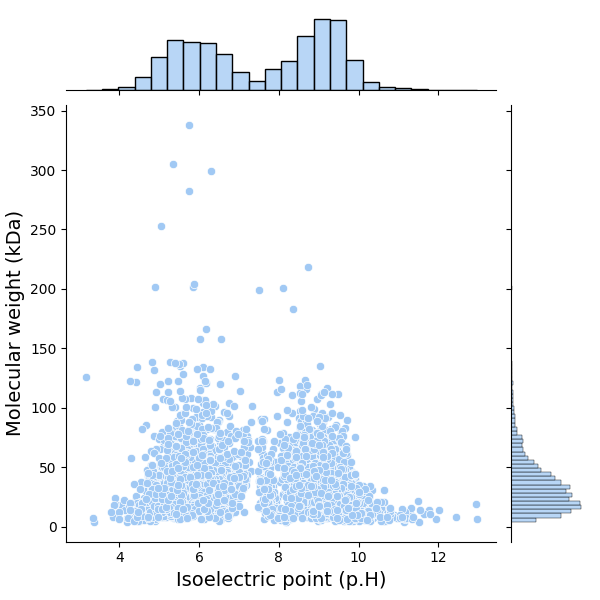
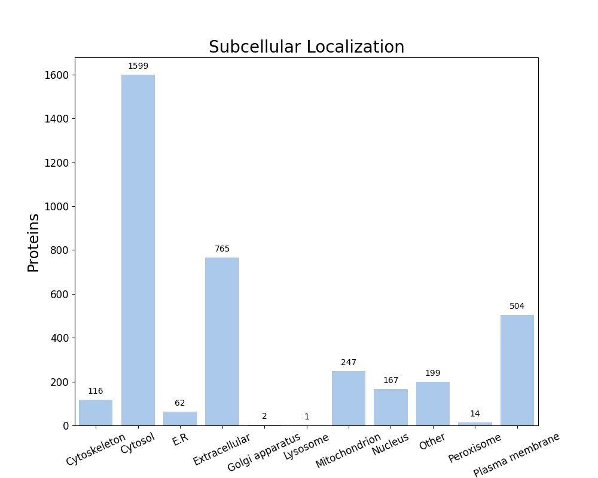

FastProtein Software 1.0
========================
##### Protein Information Software

---
### Summary
| Information                          | Value              |
| ------------------------------------ | ------------------ |
| Processed proteins                   | 3676               |
| Molecular mass (kda) mean            | 35.77 &#177; 25.77 |
| Isoelectric point mean               | 7.58 &#177; 1.77   |
| Hydrophicity mean                    | -0.20 &#177; 0.37  |
| Aromaticity mean                     | 0.10 &#177; 0.04   |
| Proteins with TM                     | 908                |
| Proteins with SP                     | 701                |
| Proteins with GPI                    | 13                 |
| Membrane proteins                    | 939                |
| Proteins with E.R Retention domains  | 512                |
| Proteins with NGlycosylation domains | 2710               |
### Molecular mass (kDa) vs Isoelectric point (pH)

---
### Subcellular localization (by WolfPSort) - Organism: animal

| Subcellular localization | Proteins |
| ------------------------ | -------- |
| Cytosol                  | 1599     |
| Extracellular            | 765      |
| Plasma membrane          | 504      |
| Mitochondrion            | 247      |
| Other                    | 199      |
| Nucleus                  | 167      |
| Cytoskeleton             | 116      |
| E.R                      | 62       |
| Peroxisome               | 14       |
| Golgi apparatus          | 2        |
| Lysosome                 | 1        |
---
### E.R Retention domain summary
| Domain | Quantity |
| ------ | -------- |
| KEEL   | 105      |
| KDEL   | 28       |
| AEEL   | 57       |
| KNEL   | 29       |
| ANEL   | 28       |
| REEL   | 37       |
| QEEL   | 33       |
| KQEL   | 22       |
| SDEL   | 22       |
| SEEL   | 67       |
Only top 10

---
### NGlyc domain summary
| Domain | Quantity |
| ------ | -------- |
| NAS    | 242      |
| NLS    | 605      |
| NLT    | 348      |
| NIS    | 324      |
| NVS    | 384      |
| NFS    | 331      |
| NGS    | 262      |
| NDS    | 234      |
| NST    | 267      |
| NSS    | 408      |
Only top 10

---
| Id     | Length |  kDa   | Isoelectric_Point | Hydropathy | Aromaticity |  Localization   | TMHMM_2 | Phobius_TM | PredGPI | Membrane_evidences | Membrane_evidences_detail |  SignalP5   | Phobius_SP | ER_Retention_Total | NGlyc_Total |           ER_Retention_Domains            |                          NGlyc_Domains                           |                                Header                                 | Local_alignment_description | Gene_Ontology | Interpro_Annotation | PFAM_Annotation | Panther_Annotation |
| ------ |:------:|:------:|:-----------------:|:----------:|:-----------:|:---------------:|:-------:|:----------:|:-------:|:------------------:|:-------------------------:|:-----------:|:----------:|:------------------:|:-----------:|:-----------------------------------------:|:----------------------------------------------------------------:|:---------------------------------------------------------------------:| --------------------------- | ------------- | ------------------- | --------------- | ------------------ |
| Q8EYG9 |  477   | 54.41  |       9.07        |   -0.37    |    0.12     |     Cytosol     |    0    |     0      |    -    |         0          |                           |      -      |     Y      |         0          |      3      |                                           |              NQS[394-397];NKS[453-456];NKT[468-471]              |             4-hydroxybenzoate brominase (decarboxylating)             | -                           |               |                     |                 |                    |
| Q8F3Q1 |  516   | 57.32  |       5.98        |   -0.28    |    0.06     |     Cytosol     |    0    |     0      |    -    |         0          |                           |      -      |     -      |         0          |      2      |                                           |                     NKT[86-89];NKS[474-477]                      |                     (R)-citramalate synthase CimA                     | -                           |               |                     |                 |                    |
| P41394 |  349   | 38.02  |       8.47        |   -0.11    |    0.06     |     Cytosol     |    0    |     0      |    -    |         0          |                           |      -      |     -      |         0          |      2      |                                           |                    NSS[125-128];NCT[146-149]                     |                 Aspartate-semialdehyde dehydrogenase                  | -                           |               |                     |                 |                    |
| Q8EXC0 |  177   | 20.83  |       5.51        |   -0.67    |    0.12     |     Cytosol     |    0    |     0      |    -    |         0          |                           |      -      |     -      |         1          |      3      |                KEEL[52-56]                |                 NAS[37-40];NLT[40-43];NVS[83-86]                 |                       Acireductone dioxygenase                        | -                           |               |                     |                 |                    |
| Q8EXX3 |  247   | 28.52  |       9.64        |   -0.67    |    0.10     |     Nucleus     |    0    |     0      |    -    |         0          |                           |      -      |     -      |         0          |      0      |                                           |                                                                  |                            Ribonuclease 3                             | -                           |               |                     |                 |                    |
| Q8EYH2 |  333   | 36.48  |       6.20        |   -0.32    |    0.08     |     Cytosol     |    0    |     0      |    -    |         0          |                           |      -      |     -      |         0          |      1      |                                           |                           NAS[311-314]                           |                 Ketol-acid reductoisomerase (NADP(+))                 | -                           |               |                     |                 |                    |
| Q8EYV8 |  385   | 41.44  |       6.26        |    0.00    |    0.06     |  Cytoskeleton   |    0    |     0      |    -    |         0          |                           |      -      |     -      |         0          |      1      |                                           |                           NNT[347-350]                           |            Arginine biosynthesis bifunctional protein ArgJ            | -                           |               |                     |                 |                    |
| Q8EZB6 |  335   | 36.72  |       8.26        |   -0.16    |    0.07     |     Cytosol     |    0    |     0      |    -    |         0          |                           |      -      |     Y      |         0          |      5      |                                           |   NDS[31-34];NFT[50-53];NGT[108-111];NET[156-159];NRT[255-258]   |             Glycerol-3-phosphate dehydrogenase [NAD(P)+]              | -                           |               |                     |                 |                    |
| Q8EZN0 |  312   | 33.82  |       6.67        |    0.05    |    0.05     |     Cytosol     |    0    |     0      |    -    |         0          |                           |      -      |     -      |         0          |      4      |                                           |       NGS[184-187];NVS[198-201];NST[260-263];NQS[303-306]        |                  Ribose-phosphate pyrophosphokinase                   | -                           |               |                     |                 |                    |
| Q8EZN3 |  655   | 72.54  |       8.60        |   -0.24    |    0.07     | Plasma membrane |    0    |     2      |    -    |         2          |    PHOBIUS_TM&#124;SL     | SP(Sec/SPI) |     -      |         3          |      3      | KEEL[188-192];QEEL[409-413];HDEL[612-616] |              NVS[112-115];NYS[542-545];NAS[593-596]              |                ATP-dependent zinc metalloprotease FtsH                | -                           |               |                     |                 |                    |
| Q8EZP1 |  498   | 56.72  |       6.48        |    0.34    |    0.12     | Plasma membrane |    0    |     7      |    -    |         2          |    PHOBIUS_TM&#124;SL     |      -      |     -      |         0          |      2      |                                           |                    NFS[365-368];NET[385-388]                     |                  Polyamine aminopropyltransferase 1                   | -                           |               |                     |                 |                    |
| Q8F031 |  197   | 22.11  |       6.01        |   -0.38    |    0.09     |     Cytosol     |    0    |     0      |    -    |         0          |                           |      -      |     -      |         0          |      0      |                                           |                                                                  |                       dITP/XTP pyrophosphatase                        | -                           |               |                     |                 |                    |
| Q8F1F5 |  541   | 61.58  |       7.59        |   -0.51    |    0.08     |      Other      |    0    |     0      |    -    |         0          |                           |      -      |     -      |         1          |      5      |                HEEL[34-38]                | NIS[114-117];NCS[169-172];NET[335-338];NAT[401-404];NYS[507-510] |      CRISPR-associated exonuclease Cas4/endonuclease Cas1 fusion      | -                           |               |                     |                 |                    |
| Q8F2Z5 |  741   | 83.23  |       9.65        |    0.47    |    0.15     | Plasma membrane |    0    |     12     |    -    |         2          |    PHOBIUS_TM&#124;SL     |      -      |     -      |         0          |      0      |                                           |                                                                  |              Phosphatidylserine decarboxylase proenzyme               | -                           |               |                     |                 |                    |
| Q8F3J3 |  538   | 60.52  |       6.62        |   -0.30    |    0.08     |  Mitochondrion  |    0    |     0      |    -    |         0          |                           |      -      |     Y      |         0          |      2      |                                           |                    NFS[275-278];NST[404-407]                     |                             CTP synthase                              | -                           |               |                     |                 |                    |
| Q8F445 |  501   | 54.74  |       5.69        |   -0.24    |    0.06     |     Cytosol     |    0    |     0      |    -    |         0          |                           |      -      |     -      |         0          |      0      |                                           |                                                                  |                     2-isopropylmalate synthase 1                      | -                           |               |                     |                 |                    |
| Q8F4I0 |  366   | 40.12  |       5.94        |   -0.20    |    0.10     |     Cytosol     |    0    |     0      |    -    |         0          |                           |      -      |     -      |         0          |      3      |                                           |                 NET[1-4];NGS[23-26];NAT[297-300]                 |                    Homoserine O-acetyltransferase                     | -                           |               |                     |                 |                    |
| Q8F4J4 |  504   | 56.06  |       6.01        |   -0.19    |    0.08     |     Cytosol     |    0    |     0      |    -    |         0          |                           |      -      |     -      |         1          |      3      |               AEEL[410-414]               |               NSS[83-86];NLT[211-214];NGS[253-256]               | UDP-N-acetylmuramoyl-L-alanyl-D-glutamate--2,6-diaminopimelate ligase | -                           |               |                     |                 |                    |
| Q8F6R2 |  362   | 40.13  |       6.41        |   -0.30    |    0.11     |  Cytoskeleton   |    0    |     0      |    -    |         0          |                           |      -      |     -      |         0          |      4      |                                           |          NGT[8-11];NTS[30-33];NGS[122-125];NDS[342-345]          |               Carbamoyl phosphate synthase small chain                | -                           |               |                     |                 |                    |
| Q8F701 |  401   | 44.36  |       5.69        |   -0.19    |    0.05     |     Cytosol     |    0    |     0      |    -    |         0          |                           |      -      |     -      |         0          |      0      |                                           |                                                                  |                 Riboflavin biosynthesis protein RibBA                 | -                           |               |                     |                 |                    |
| Q8F7H3 |  106   | 12.01  |       5.11        |   -0.37    |    0.10     |     Cytosol     |    0    |     0      |    -    |         0          |                           |      -      |     -      |         0          |      1      |                                           |                             NVT[5-8]                             |              Pyrimidine/purine nucleoside phosphorylase               | -                           |               |                     |                 |                    |
| Q8F7H9 |  1046  | 122.76 |       5.47        |   -0.46    |    0.12     |     Nucleus     |    0    |     0      |    -    |         0          |                           |      -      |     -      |         1          |      5      |               KEEL[283-287]               |   NVS[1-4];NET[168-171];NLS[619-622];NQS[662-665];NFS[777-780]   |                      RecBCD enzyme subunit RecB                       | -                           |               |                     |                 |                    |
| Q8F7V1 |  353   | 39.84  |       8.70        |   -0.24    |    0.09     |     Cytosol     |    0    |     0      |    -    |         0          |                           |      -      |     -      |         0          |      1      |                                           |                            NQT[8-11]                             |         Probable dual-specificity RNA methyltransferase RlmN          | -                           |               |                     |                 |                    |
| Q8F832 |  1106  | 122.85 |       5.22        |   -0.17    |    0.07     |  Extracellular  |    0    |     0      |    -    |         0          |                           |      -      |     -      |         0          |      0      |                                           |                                                                  |               Carbamoyl phosphate synthase large chain                | -                           |               |                     |                 |                    |
| Q8F8T4 |  428   | 47.72  |       5.54        |   -0.22    |    0.08     |  Cytoskeleton   |    0    |     0      |    -    |         0          |                           |      -      |     -      |         0          |      4      |                                           |         NES[8-11];NFS[296-299];NQS[369-372];NIT[386-389]         |                     2-isopropylmalate synthase 2                      | -                           |               |                     |                 |                    |
| Q9XD15 |  187   | 20.59  |       6.41        |   -0.31    |    0.04     |     Cytosol     |    0    |     0      |    -    |         0          |                           |      -      |     -      |         0          |      1      |                                           |                            NQT[41-44]                            |                           Adenylate kinase                            | -                           |               |                     |                 |                    |
##### Only top 10 proteins

---

##### Do you have a question or tips? Please contact us! E-mail: renato.simoes@ifsc.edu.br
Generated time: Mon Apr 06 15:19:19 UTC 2026